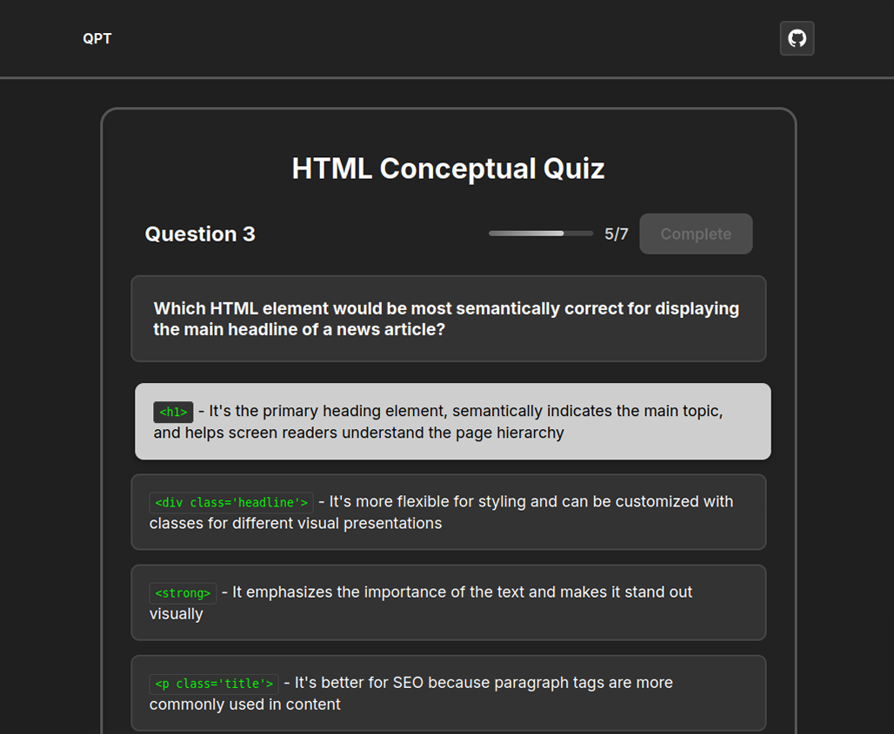

  

	
  

	<h1 align="center"><b>Quick Programming Test (QPT)</b></h1>
	

		Just practice.
     
    Website: <a href="https://quick-programming-tests.vercel.app/"><strong>https://quick-programming-tests.vercel.app/</strong></a>
  

QPT is an open-source quiz platform designed to help you quickly practice for interviews or reinforce your knowledge in specific skills. Whether you’re preparing for a big opportunity or just want to sharpen your expertise, QPT makes it easy to test yourself and learn fast.

With minimal friction, no required sign-ups, no distractions, one click and you're ready to practice!

## Motivation
Whenever I prepared for interviews or wanted to sharpen my skills in a specific technology, I often turned to typical LeetCode problems. However, I eventually realized that many technical interviews focus not just on coding challenges, but also on conceptual understanding and technology-specific knowledge. I built this platform to provide a quick and focused way to practice those concepts through short quizzes. Also, after using it myself multiple times, I've been able to reinforce and even correct key ideas—so I hope it helps others do the same!

## Architecture

### Frontend:
- Angular
- Sass (SCSS)

### Backend:
- MongoDB
  - with Mongoose
- Cors
- Nodejs
- Express

## Contributing
**Every** contribution matters, whether it's documentation, refactoring, adding new ideas/components, or anything else you believe would be a valuable addition. Please refer to the [contributing guide](CONTRIBUTING.md) for directions!
